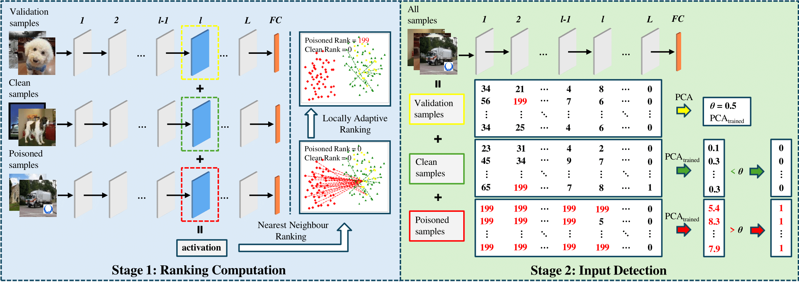

# TED++: Submanifold-Aware Backdoor Detection via Layerwise Tubular-Neighbourhood Screening

<!-- This repository implements the methods from the paper:

> **TED++: Submanifold-Aware Backdoor Detection via Layerwise Tubular-Neighbourhood Screening**   -->
<!-- > [Paper Link](https://arxiv.org/abs/xxxx.xxxxx) -->

TED++ (Submanifold-Aware Backdoor Detection) is a robust backdoor detection method for deep learning models, designed to work with minimal validation data. It extends the original TED approach by introducing locally adaptive ranking, improving detection accuracy and robustness.

**This implementation builds upon:**
- [backdoor-toolbox](https://github.com/vtu81/backdoor-toolbox)
- [ted](https://github.com/tedbackdoordefense/ted)

We thank the authors of these repositories for their foundational work.

---

## Features

- **TED**: Topological Evolution Dynamics for backdoor detection.
- **TED++**: Locally Adaptive Ranking for enhanced robustness.
- Integrates with a wide range of backdoor attacks and defenses.
- Modular and extensible for research purposes.

---

## Installation

1. **Install PyTorch** (with CUDA if available):  
   See [PyTorch installation guide](https://pytorch.org/get-started/locally/).

2. **Install other dependencies:**  
   ```
   pip install -r requirement.txt
   ```

---

## Data Preparation

- **CIFAR10, GTSRB, MNIST, and TinyImageNet**: Downloaded automatically.
- **ImageNet**: Download manually from [Kaggle](https://www.kaggle.com/competitions/imagenet-object-localization-challenge/data) and set the path in `config.py` (`imagenet_dir`).
- **Initialize clean/validation data** (required before any experiment):  
  ```
  python create_clean_set.py -dataset=<DATASET> -clean_budget <N>
  ```
  - `<DATASET>`: `cifar10`, `gtsrb`, `mnist`, `tinyimagenet`, `ember`, `imagenet`
  - `<N>`: `2000` for `cifar10`, `gtsrb`, `mnist`, `tinyimagenet`; `5000` for `imagenet`

---

## Running TED and TED++ Experiments

Both TED and TED++ are implemented in `other_defenses_tool_box/TED.py` and `other_defenses_tool_box/TEDPLUS.py`, and are run via the unified interface in `other_defense.py`.

### Example: Run TED

```bash
python other_defense.py -defense=TED -dataset=cifar10 -poison_type=badnet -poison_rate=0.01
```

### Example: Run TED++

```bash
python other_defense.py -defense=TEDPLUS -dataset=cifar10 -poison_type=badnet -poison_rate=0.01
```

**Common arguments:**
- `-dataset`: Dataset name (`cifar10`, `gtsrb`, `mnist`, `tinyimagenet`, `imagenet`, etc.)
- `-poison_type`: Type of backdoor attack (`badnet`, `blend`, etc.)
- `-poison_rate`: Poisoning rate (e.g., `0.01`)
- `-cover_rate`, `-alpha`, `-test_alpha`, `-trigger`, etc. (see `utils/default_args.py` for all options)
- `-validation_per_class`: Number of validation samples per class (default: 20)
- `-num_test_samples`: Number of test samples (default: 50)
- `-class_ratio`: (TED++ only) Ratio of missing classes (default: 0)

**For full options:**
```bash
python other_defense.py -h
```

---

## Experiment Order

1. **Prepare clean/validation data** (see above).
2. **Create a poisoned training set** (if needed):
   ```bash
   python create_poisoned_set.py -dataset=cifar10 -poison_type=badnet -poison_rate=0.01
   ```
3. **Train a model on the poisoned set:**
   ```bash
   python train_on_poisoned_set.py -dataset=cifar10 -poison_type=badnet -poison_rate=0.01
   ```
4. **Run TED or TED++:**
   ```bash
   python other_defense.py -defense=TED -dataset=cifar10 -poison_type=badnet -poison_rate=0.01
   # or
   python other_defense.py -defense=TEDPLUS -dataset=cifar10 -poison_type=badnet -poison_rate=0.01
   ```

---

## Citation

If you use this code, please cite:

```
@article{tedpp_defense,
  title={TED++: Submanifold-Aware Backdoor Detection via Layerwise Tubular-Neighbourhood Screening},
  author={...},
  journal={...},
  year={2025}
}
```

**And acknowledge:**
- [backdoor-toolbox](https://github.com/vtu81/backdoor-toolbox)
- [ted](https://github.com/tedbackdoordefense/ted)

